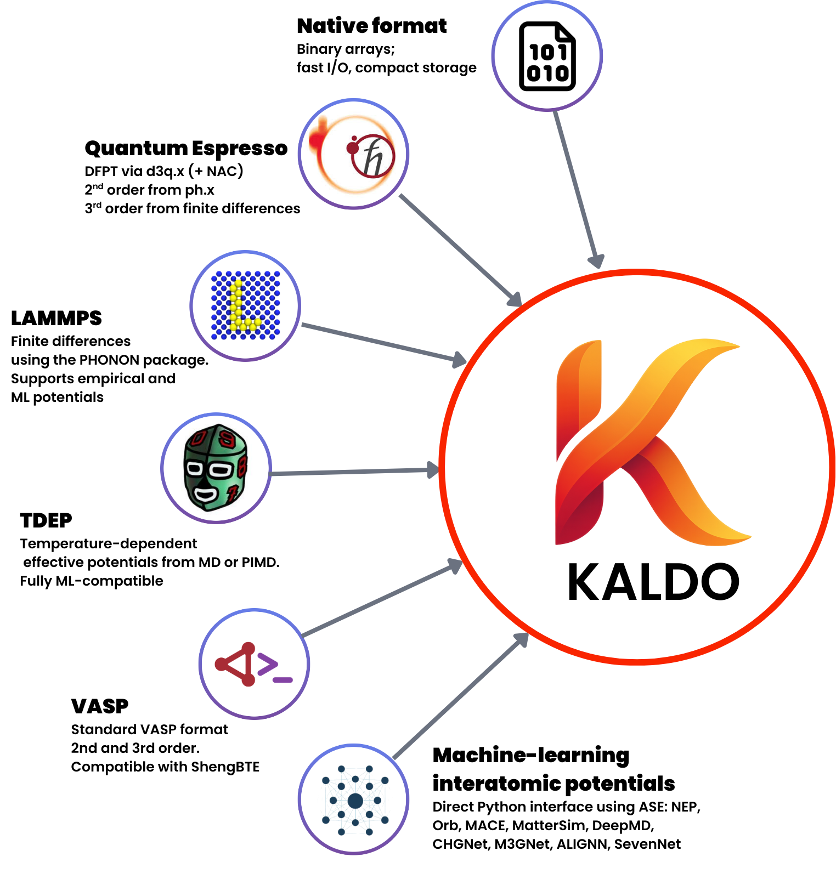

# kALDo Examples

Official repository demonstrating various examples to use [kALDo](https://github.com/nanotheorygroup/kaldo) for thermal transport calculations.

<p align="center">

</p>

## Overview

This repository provides examples demonstrating how to compute thermal conductivity using kALDo with two complementary approaches:

- **Boltzmann Transport Equation (BTE)**: Solves for phonon populations under a temperature gradient
- **Quasi-Harmonic Green-Kubo (QHGK)**: A unified approach interpolating between particle-like and wave-like thermal transport

The examples cover workflows with:

- **Machine Learning Potentials** (orb, NEP, MatterSim, ACE, UPET)
- **Density Functional Theory** (Quantum ESPRESSO, D3Q)
- **Empirical Potentials** (Any Empirical Potentials Supported in LAMMPS)
- **Finite Temperature Effective Potentials** (TDEP)


## Tutorial Examples

| # | folder | category | creator | description |
| --- | --- | --- | --- | --- |
| 1 | [cesium_lead_bromide_NEP_TDEP](cesium_lead_bromide_NEP_TDEP) | ML Potentials | Dylan Folkner, Zekun Chen | Thermal transport in cubic CsPbBr₃ (5 atoms/cell) using TDEP and GPUMD. |
| 2 | [gallium_arsenide_orb-v3_ORBCalculator](gallium_arsenide_orb-v3_ORBCalculator) | ML Potentials | Zekun Chen, Higo Oliveira | Thermal transport in gallium arsenide (2 atoms/cell) using Orb. |
| 3 | [silicon_MatterSim-v1-1M_mattersimcalculator](silicon_MatterSim-v1-1M_mattersimcalculator) | ML Potentials | Dylan Folkner, Zekun Chen  | Thermal expansion coefficients of silicon diamond (2 atoms/cell) using MatterSim. |
| 4 | [silicon_NEP89_calorine](silicon_NEP89_calorine) | ML Potentials | Zekun Chen | Thermal transport in silicon diamond (2 atoms/cell) using calorine. |
| 5 | [silicon_carbide_MatterSim-v1-1M_mattersimcalculator](silicon_carbide_MatterSim-v1-1M_mattersimcalculator) | ML Potentials | Zekun Chen | Thermal transport in silicon carbide (2 atoms/cell) using MatterSim. |
| 6 | [wurtzite_aluminum_nitride_ACE_PyACE](wurtzite_aluminum_nitride_ACE_PyACE) | ML Potentials | Zekun Chen | Thermal transport in wurtzite aluminum nitride (4 atoms/cell) using pyACE. |
| 7 | [sodium_chloride_UPETCalculator](sodium_chloride_UPETCalculator) | ML Potentials | Zekun Chen, Davide Donadio | Thermal transport in sodium chloride (2 atoms/cell) using UPET. |
| 8 | [amorphous_silicon_Tersoff_LAMMPS](amorphous_silicon_Tersoff_LAMMPS) | Empirical | Giuseppe Barbalinardo | Thermal transport in amorphous silicon (512 atoms/cell) using LAMMPS PHONON. |
| 9 | [carbon_diamond_Tersoff_ASE_LAMMPS](carbon_diamond_Tersoff_ASE_LAMMPS) | Empirical | Zekun Chen | Thermal transport in carbon diamond (2 atoms/cell) using ASE and LAMMPS. |
| 10 | [carbon_nanotube_Tersoff_LAMMPS](carbon_nanotube_Tersoff_LAMMPS) | Empirical |Giuseppe Barbalinardo, Zekun Chen, Davide Donaido | Thermal transport in a (10,0) carbon nanotube (40 atoms/cell) using LAMMPS PHONON. |
| 11 | [silicon_clathrate_Tersoff_LAMMPS](silicon_clathrate_Tersoff_LAMMPS) | Empirical | Higo Oliveira, Zekun Chen | Thermal transport in a type I silicon clathrate (46 atoms/cell) using LAMMPS PHONON. |
| 12 | [germanium_dft_d3q](germanium_dft_d3q) | DFT |Alfredo Fiorentino, Mattias Perez | Thermal transport in germanium diamond (2 atoms/cell) using D3Q. |
| 13 | [magnesium_oxide_dft_d3q](magnesium_oxide_dft_d3q) | DFT | Nicholas Lundgren, Mattias Perez | Thermal transport in rock-salt MgO (2 atoms/cell) using D3Q. |
| 14 | [silicon_dft_qe](silicon_dft_qe) | DFT | Bohan Li, Mattias Perez, Zekun Chen | Thermal transport in silicon diamond (2 atoms/cell) using Quantum ESPRESSO. |

## Contributing

We welcome contributions from the community! If you have a thermal transport workflow using kALDo, whether with a new potential, a different material system, or an alternative method, we'd love to include it.

### How to contribute an example

1. Fork the repository and create a new branch (`git checkout -b your-branch-name`)
2. Add your example in the appropriate category folder (`machine_learning_potentials/`, `density_functional_theory/`, or `empirical_potentials/`)
3. Include a `README.md` describing the calculation and a Jupyter notebook (`.ipynb`) for visualization
4. Push your branch and open a Pull Request

The documentation is auto-generated from the example folders, so your example will automatically appear on the docs site once merged.

For questions or suggestions, feel free to [open an issue](https://github.com/nanotheorygroup/kaldo-examples/issues).

## Building the Documentation

### Requirements

```bash
pip install sphinx sphinx-immaterial nbsphinx myst-parser
```

### Build

```bash
cd docs
make html
```

The documentation will be generated in `docs/_build/html/`.
